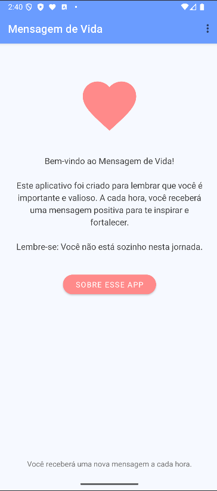

# Mensagem de Vida - App de Apoio Emocional


Aplicativo Android que envia mensagens motivacionais a cada hora para oferecer apoio emocional e promover bem-estar mental.

## 📱 Sobre o Projeto

O **Mensagem de Vida** é um aplicativo simples mas poderoso que:
- Envia notificações periódicas com mensagens positivas
- Oferece apoio emocional discreto
- Funciona em segundo plano
- Não coleta dados do usuário

> "Um lembrete gentil de que você não está sozinho(a) em sua jornada"


## ✨ Funcionalidades

- ✔️ Notificações horárias automáticas
- ✔️ Banco de dados com +200 mensagens motivacionais
- ✔️ Funciona mesmo com app fechado
- ✔️ Sem anúncios ou cobranças

## 📸 Telas do App

| Tela Principal | Tela "Sobre" |
|----------------|-------------|
|  |  |
| *Mensagem inicial e botões de ação* | *Informações sobre o app e recursos de ajuda* |

## ⚡ Como Usar

1. **Baixe o APK** disponível na raiz do projeto `app-debug.apk`
2. Instale em qualquer dispositivo Android (5.0+)
3. Conceda permissão para notificações
4. Receba mensagens inspiradoras automaticamente

## 🤝 Contribuição

Este projeto é **open source** e aceita contribuições!

Como ajudar:
1. Faça um fork do projeto
2. Crie sua branch (`git checkout -b feature/nova-feature`)
3. Commit suas mudanças (`git commit -m 'Adiciona nova funcionalidade'`)
4. Push para a branch (`git push origin feature/nova-feature`)
5. Abra um Pull Request

**Áreas que precisam de ajuda:**
- ❗Sugestões de novas mensagens motivacionais❗
- Traduções para outros idiomas
- Revisar melhor forma de guardar as mensagens
- Melhorias de design/UX
- Testes em diferentes dispositivos
- Funcionalidade para definir manualmente o intervalo das mensagens

## 📦 Estrutura do Projeto
```
mensagem-de-vida/
├── app/                 # Código fonte principal
├── README.md            # Este arquivo
├── mensagemdevida.apk   # Versão instalável
└── screenshots/         # Pasta para prints das telas
```

### ✨ Adicionando Novas Mensagens

Edite o arquivo:
`app/src/main/java/com/example/mensagemdevida/DatabaseHelper.java`

Na função `initializeMessages()`, adicione novas frases mantendo o formato:

```java
String[] messages = {
    "Sua nova mensagem motivacional aqui,",
    "Outra mensagem inspiradora aqui,"
    // ...
};
```

### 💡Inspiração
Este projeto foi inspirado pela @stbelscc (X/Twitter) que deu a ideia do app. 